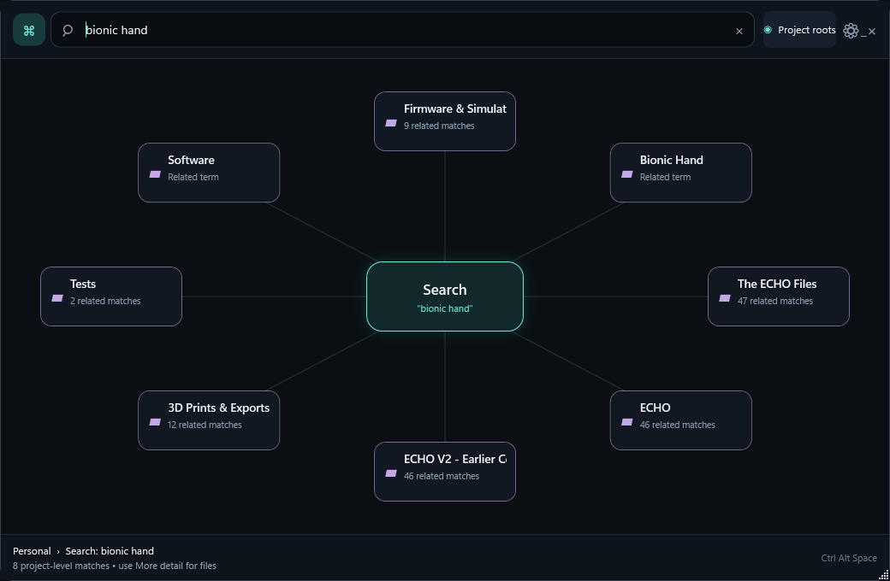

# Personal Navigator

**Find the project, not the clutter.** Personal Navigator is a free, MIT-licensed Windows desktop app that maps and searches your local project folders. It prioritizes useful project roots over long lists of unrelated files.

Created and maintained by **Abhijay Panwar**.

[Website](https://linux-cmd.github.io/personal-navigator/) · [Download latest release](https://github.com/linux-cmd/personal-navigator/releases/latest) · [Install guide](docs/INSTALLATION.md) · [Report a bug](https://github.com/linux-cmd/personal-navigator/issues/new/choose)



## What you can do

- Press **Ctrl+Alt+Space** to open the project map from anywhere on Windows.
- Search names, paths, approximate spellings, and a local list of related words. This is **not** an AI semantic search service.
- View relevant projects first, then switch to deeper file and subfolder results.
- Open folders directly in Windows Explorer or use **Open Personal Map** from Explorer.
- Customize exclusions, indexing of file types, animations, startup and display preferences.
- Work entirely locally: no account, search server or file uploads.

**Important:** By default, the app searches `%USERPROFILE%\Personal`. Create a folder named `Personal` in your user profile and place your projects inside it before running the app. Customizing the index root is not yet supported.

## Download and install

1. Open the [latest Windows release](https://github.com/linux-cmd/personal-navigator/releases/latest).
2. If available, download `PersonalNavigator-Setup-win-x64.exe` and follow the setup wizard.
3. Older releases such as v1.0.0 contain only a ZIP; extract it and run `Install-PersonalNavigator.ps1`.
4. Press **Ctrl+Alt+Space**.

**System requirements:** Windows 10/11 x64. Currently unsigned; Windows SmartScreen may warn. The installer uses the current Windows user and requires no administrator permissions. There is no automatic updater yet: check GitHub Releases to install updates manually.

See [installation, upgrade and uninstall instructions](docs/INSTALLATION.md). Linux and macOS builds are not available because this interface uses WPF.

## Build and test

On Windows with the .NET 8 SDK:

```powershell
dotnet build .\program\PersonalNavigator.csproj -c Release
dotnet run --project .\program\tests\SmokeTest\SmokeTest.csproj -c Release
```

To package a release you also need NSIS 3.x:

```powershell
.\scripts\Build-Release.ps1 -Version 1.1.0
.\scripts\Build-Installer.ps1 -Version 1.1.0
```

**Repository:** `program/` desktop source and tests; `website/` static website; `scripts/` packaging and installer; `docs/` install and [release guide](docs/RELEASING.md); `.github/` CI and release automation.

## Trust, contributions and support

Read [architecture](docs/ARCHITECTURE.md), [security reporting](SECURITY.md), [contribution instructions](CONTRIBUTING.md) and [changes](CHANGELOG.md). Report reproducible bugs through issue templates. The app indexes local file names and paths; do not attach screenshots containing private paths or data.

Licensed under [MIT](LICENSE).
